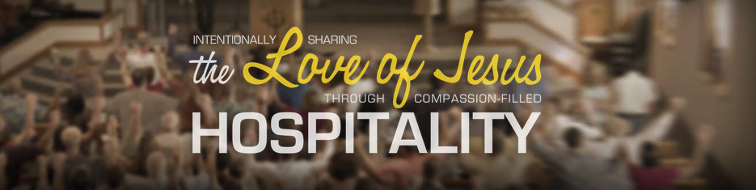
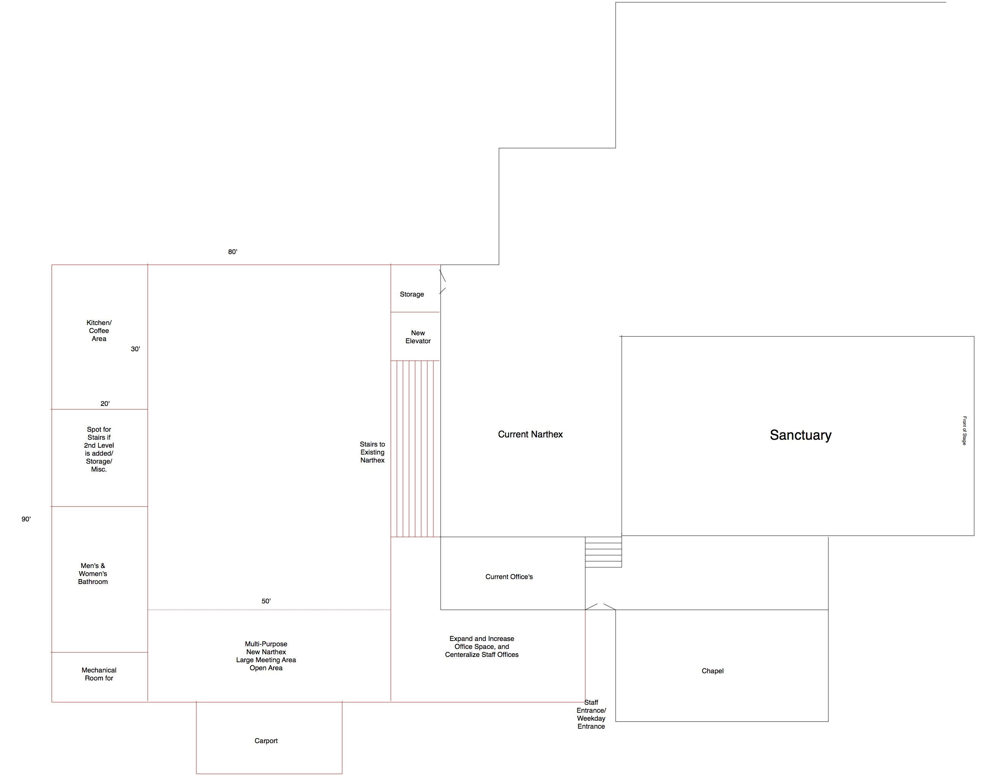
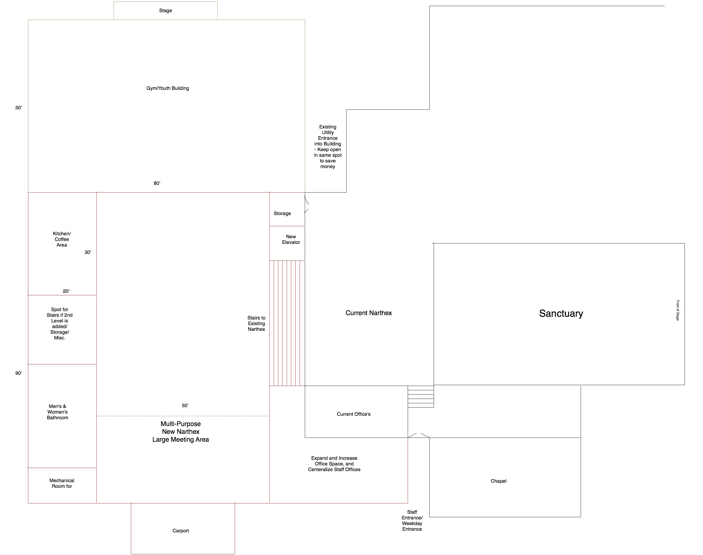
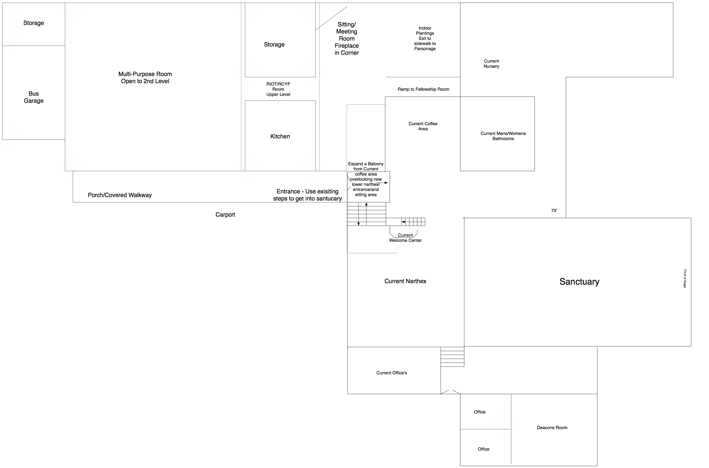

# Building Vision

## Building Team
### Part 2
#### April 2014

During the summer of 2013 NHRC’s consistory created a follow up team to the *Building Vision Task Force*, (B.V.T.F.) asking for that team to provide information and drawings of what an addition to our current facilities could look like and report back.
In the report that follows this team is presenting drawings of what a new addition to the building might look like along with commentary for options with the goal of addressing documented needs while keeping the NHRC vision of intentionally sharing the love of Jesus through compassion-filled hospitality in mind.

## Team Goal

With information provided and reported to NHRC’s consistory by the B.V.T.F. and directed by consistory, this team will review and present brick-and-mortar options to consistory that would address those needs while keeping the vision of intentionally sharing the love of Jesus through compassion-filled hospitality.

<!--BREAK-->

## Executive Summary

In this report the building team is presenting 2 drawings representing ideas on what the new addition may look like.  It should be noted that even with the work done to develop these drawings there are factors and design options that could not all be captured in the scope of this project.  NHRC’s long term goals, facility use and financial position will need to be part of the final design of the building.

Accompanying the drawings in this report you will find commentary which will include points that the team felt to be important to document related to the building construction but also thoughts around the use of the building.  The team did conduct a meeting with a cross section of NHRC members where the organization called “Building Gods Way” and their concepts were presented in video form.  We want to make sure that it is understood that the reason for the meeting was to present concepts and thoughts related to the church building and not a solicitation to promote their services.  This topic will be presented later in this report.

It is requested that in order to understand the total scope of the information presented in this document that NHRC consistory review closely the comments presented, the drawings, but also watch the video’s played on the “Building God’s Way” concept and prayerfully consider more than just the brick and mortar buildin involved with construction but also the uses and management of the facility.

### Phase 1 Recommendations
#### Executive Summary

Recommendations from the BVTF suggest that actions be taken in a number of areas of our church facilities.
The narthex, fellowship hall, kitchen, exterior, classrooms, meeting rooms, offices and storage have been identified as areas that require attention.

It is our recommendation that changes be made to the narthex in order to improve the overall pedestrian flow in and out of the sanctuary as well as reduce congestion during social functions. The BVTF team believes the Fellowship Hall and Kitchen does not meet the current needs of the church and as a result is under utilized. Concern involving the Exterior of the church pertained mostly to areas that complement the church. Concerns about the parking lot were expressed. (The need for parking lot improvements had been identified prior to this report.) Handicap parking, wheelchair accessibility and confusion about which doors to enter the church were other identified concerns. The current “main” entrance is hidden in back, which may not be noticed by visitors. After entering the building, people often have a difficult time locating the sanctuary, classrooms, nursery, bathrooms, etc. Based primarily upon the staff questionnaire responses, the BVTF recommends that any future addition or change to the building incorporate more centralized offices. The BVTF recommends that more storage areas be made available in classrooms for teachers, indoor storage for custodial staff and ministry teams, as well as outdoor storage for building and grounds. Most ministry teams identified classrooms as a priority.

The BVTF believes it will be necessary to carefully consider each recommendation and how addressing one area may impact another in order to maximize both meeting the church’s needs and being faithful stewards of the funds available to the church. It should be noted that making recommendations on an order in which each task should be handled is difficult as in certain situations a remedy in one area may lead to an improvement in another. Because of this it is our suggestion that an architect or consultant be brought in to assist with the final layout of the facility. Staying consistent with what the BVTF was tasked to do this report is not intended to explain how to do the work to make improvements or to proceed but to identify the opportunities that exist.
We believe additional in depth work will be needed.

<!--BREAK-->

## Congregation Meeting and Questionnaire

The building team felt it appropriate to make every effort to continue to involve the congregation as much as possible as we continue this process.  The intent of this smaller segment of the congregation meeting was:

1. To present the concept’s used in “Building Gods Way” ministries.
2. To get feedback on the concepts presented in the video – played during the meeting.
3. To get input on what the congregation felt to be important to have in an addition.

The questions asked and the responses can be found in Appendix A along with a link to the video.

Congregation members invited to this meeting represented a sample of different age groups and family make up.  33 members from the congregation were invited to the meeting; winter weather conditions unfortunately had a negative impact on the number of people that were able to attend impacting attendance to approximately 15, but still a good cross section of ages.

The team does suggest that this video be viewed by consistory for content and the sake of concepts.  There are for sure some topics presented that should be considered.

<!--BREAK-->

## Building Design Options

With aid from information provided by the B.V.T.F. and the requested work to be done by consistory the team is presenting two separate diagrams.  The team feels that the work done has addressed and identified current documented needs for the building:  Storage, Meeting areas for adults and kids, building accessibility and flow, Fellowship areas and etc.  It is believed that the drawings fulfilled what was requested of us by consistory.  It should be noted that the drawings presented are not final design proposals but examples (or starting point) for NHRC to use as a base template.

<!--BREAK-->

### Option A

<!--BREAK-->

#### Option A1

<!--BREAK-->

### Option B

<!--BREAK-->

### Things to Consider in the New Building Design

The following are points that the team felt were important topics and worth documenting.  These points along with the findings from the B.V.T.F. should be considered together as next steps are considered.

* A firewall and other building fire systems will  need to be installed to separate stay in code with  the new addition from the sanctuary.  This can be accomplished in a number of methods
* Location of electrical boxes and utilities
* Gymnasium can be a stand alone section of the building so it does not have to be constantly heated
* New appliances for the kitchen (sell old?)
* Entry for car port at Sanctuary level
* Grade for accessibility for downstairs and upstairs
* Faster and bigger elevator to reach all floors
* Wheelchair accessibility from parking lot and throughout the church
* Obvious “main” entrance that is properly marked
* Minimize confusion on flow once in the church
* Indoor Storage 
    - Custodial
* Outdoor Storage
    - Building and Grounds
* Memorial Garden
    - (Plans are already in the works for memorial walkway)
    - Cremation Memorial Wall
    - Cremation Memorial in Ground
* Parking Lot exit/entrance
* Centralized Offices for Staff
* Classrooms – Storage
* Classroom size
* Technology in the classrooms (currently only 2 TVs on carts)
* Sanctuary
    - Size (can seat about 400 people, average number was 236, high at 277)
    - What fullness level makes it uncomfortable for visitors? 80%?
    - Repurpose current sanctuary space
* Roofline
* NO FLAT ROOFS
* Classrooms need server?
* Playground
* Green space
* At some point we will have to go to an architect, the more we can flesh out ideas the better the cost
* After School Programs / Extra programs
    - Daycare
    - Meal programs
    - Boys and Girls clubs
* Ability for service to be going on without interrupting other service
    - Ex: Service in gym simultaneously with sanctuary
* Build the need, don’t assume the need
* Chapel – does it remain in current form?
    - Could remove (save the windows)
    - No handicap access
    - Current size is a challenge for multiple uses – Baby cry room?
* Gym
* Pole Barn
    - Pole Barn could be less expensive for a gym
    - Insulate, but don’t need much heat
* Would we use an addition enough?
* Faith Church hasn’t used addition enough to justify the expense
* Covered space
* Could use as event rental space
    - recognize that damage could be done
    - wear and tear, outside people do more damage
* Facilities Management
* Long Term Church Planning
* Maintaining
* Use

<!--BREAK-->

## The Building Now

Please reference the B.V.T.F. report from 2012.  This report represents this area the most complete manner.

As the team worked on this project a number of items were discussed that are pertinent and should be considered in a timely fashion as it relates to this project and maintaining the facility.

* The boiler is in need of attention / replacement.
    - Geothermal considerations

Roll in building updates as part of this project.  Caution: Don’t spend now just to replace later IF the building project moves forward.  At the same time don’t put off projects using the new building as an excuse.

* Parking Lot
* Roof
* Lighting in the sanctuary
* Handicap Parking
* Classroom updates
* Servers – Technology
* Video feed of service for nursery or cry room

<!--BREAK-->

## Closing Statements

What’s next?  Obviously this is a big question and one that should not be rushed into.  There are some things however that the building team feels is important to point out.

* Energy rebate programs are expiring in 2016 with programs currently in place that could save as much as 10% or more of the cost which apply to geothermal, lighting an other concepts that could provide long term cost benefits to NHRC.
Repairs to the parking lot should co-inside with construction – be aware however of potential safety issues that may currently be happening.
* It has been a long time since any significant money has been spent updating the church.  Approximately 25 years since the sanctuary was turned and a number of years since the fellowship area was built.
* The report presented by B.V.T.F. in 2012 outlines very well the specific areas of the church that need attention.   That team worked closely with the congregation to outline needs and as such that report needs to be referenced.
* The building needs to be used more than it currently is.
* Build for the kids.
* *Intentionally sharing the love of Jesus through compassion-filled hospitality*

How will the building be used?  Will the building be used MORE?  Will our congregation be open to uses that are less traditional?  How will we manage the building? Will we rent space to outside organization to help cover expense of the building?  Will we promote the use of the building?

NHRC is in a great place to even be able to consider this project.

<!--BREAK-->

## NHRC Long Term Vision
What is the long term vision IF NHRC moved forward with this project?

<!--BREAK-->

# Resources

* B.V.T.F. report gave good internal insight of current need and a micro look of need inside NHRC’s walls.
* [Building God’s Way Seminar](http://www.bgwservices.com/BGW-Fall-Online-Event6&7.html)
    - [YouTube Videos of Seminar](https://www.youtube.com/watch?v=hazKQeArpEo&list=PLpu8E_6FONfD8ByryIMzyqbIBVh3U-MPY)
* [B.V.T.F. Report from 2012](http://nhrc.github.io/bvtf/phase1/index.html)
* Building Team Congregation Involvement Meeting Exibit A
* Diagrams Exibit B

## Team
* Karen Kamphuis
* Dale Veldheer
* Larry Van Rhee
* Mike DenBlyker
* Denny Drooger
* Kelly Vandenbosh
* Scott Blackmer
* Ross Becksfort
* Alison Major

<!--BREAK-->

# Appendix A
## Building Vision Meeting / Building Gods Way Review
02-17-2014
### Questionnaire for attendees

**Do you believe our Church is in need of an addition to our building? (Yes/No if no please briefly explain)**

Yes.

* Re-build/tear down parts, currently inefficient and old looking. 
* Maybe remodel instead of build. 
* Multi purpose room for all church activities, youth gathering, outreach. 
* To better continue to grow with our vision of hospitality we need facilities.
* Make sure the building is what is limiting growth, make sure we have a clear vision to use the building. 
* Think we need to settle with a new pastor first. 
* Or just renovate.

**Do you believe we should investigate the service provided by this organization?  (Yes/No if no please briefly explain)**

* NO, we can.
* Yes. May be beneficial to get an experienced perspective but stay true to who NHRC is. 
* Depending on productivity and cost.

**Are you open to our church facility being used for non-church activities? (Yes/No if no please briefly explain)**

Yes, great outreach + hospitality, not keen on “for profit”. 

* concerned about the people who would responsible for cleaning. 
* Get people to use our church. 
* Uses for the community. 
* Rent to cover expenses.

**Since watching this video has your thinking about what our building is used for changed? If yes in what way?**

Yes.

* Renting to bring in more people.
* Not really, I like the emphasis on having a vision for it. 
* Broadened my thoughts on bring people in from the community and uses. 
* Considering the community and ministering to them. 
* There are a number of churches in the area, what would make us unique? 
* Use more for outsider events but worry about those cleaning.

 If you could only pick only 3 things to do in remodel what would they be?
* Child care, youth ministries. 
* Coffee area, space for games, gym, better traffic flow. 
* Kitchen, multi purpose, play ground, office. 
* Kitchen fellowship area, easier entry to the building. 
* Fellowship area on main floor, offices, meeting space, classrooms. 
* Larger Commons area, Childrens area, classes, playground, large function area. 
* Gym, playground. 
* Kitchen, coffee area, traffic flow. 
* Preliminary to the building a good vision in place, consider mainetance , open concept to the building, staff centralized. 
* New elevator, Kitchen, entrance to main floor, kids rooms. 
* Office, kitchen, entry.

Video Reference:

* [Building God’s Way Seminar](http://www.bgwservices.com/BGW-Fall-Online-Event6&7.html)
* [YouTube Videos of Seminar](https://www.youtube.com/watch?v=hazKQeArpEo&list=PLpu8E_6FONfD8ByryIMzyqbIBVh3U-MPY)

<!--BREAK-->

# Appendix B

### Option A

<!--BREAK-->

#### Option A1

<!--BREAK-->

# Appendix C 

### Option B

